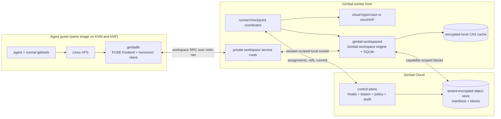

# Gimbal Living Workspaces

**Status:** Product and engineering specification  
**Date:** 2026-07-31  
**Scope:** Gimbal Local, Gimbal Cloud, and Gimbal agent images  
**Implementation ownership:** Gimbal-only; no prior-system dependency or compatibility

## 1. Executive decision

Gimbal will make the workspace a first-class part of a session.

An agent session is not only vCPUs, RAM, devices, and a root disk. It is also
the exact working filesystem the agent produced: tracked source, untracked
work, dependency trees, compiler outputs, indexes, and other expensive state.
That workspace must be able to:

- checkpoint with the running VM;
- fork in constant time for parallel agents;
- follow normal Git commits, checkouts, resets, branches, and merges without
  teaching the agent a new workflow;
- move between Gimbal Cloud and Gimbal Local;
- hydrate lazily from content-addressed storage;
- preserve ignored build artifacts without accidentally transporting secrets;
- be governed by the same signed policy on KVM and HVF.

The working product name is **Gimbal Living Workspaces**. It is not a
separate storage product. The lifecycle, policy, identity, checkpoint contract,
UI, cloud transport, metadata engine, content store, layer model, merge engine,
guest frontend, and host service are all in this project scope.

### Prior-system independence requirement

The supplied prior-system demos helped express the desired user experience. **The prior system cannot
be used to implement this product.**

Gimbal must not:

- depend on, vendor, fork, link, import, or execute any prior-system crate, library,
  binary, service, or repository content;
- copy or adapt prior-system source code, database schemas, migrations, wire protocols,
  manifests, storage formats, tests, or internal APIs;
- claim read/write compatibility with a prior-system volume or checkpoint;
- make prior-system availability, behavior, or releases part of a Gimbal runtime or
  build contract.

All components and formats in this specification are independently designed,
implemented, tested, secured, and maintained in Gimbal-owned code. General
filesystem techniques such as FUSE, copy-on-write layers, content-addressed
blocks, and three-way merge are requirements to implement, not permission to
reuse prior-system implementation material.

### Non-negotiable compatibility rule

**A vanilla Cloud Hypervisor snapshot remains a vanilla Cloud Hypervisor
snapshot.**

Gimbal does not add fields to Cloud Hypervisor's `state.json`, require a forked
Cloud Hypervisor binary, or require a Gimbal-specific virtual device to boot an
ordinary snapshot. Living Workspace state lives in a signed Gimbal session
envelope beside the compute snapshot. The baseline guest transport uses the
standard virtio-net device already present in a Gimbal agent image.

This creates two valid products:

1. **Vanilla mode:** any compatible arm64 Cloud Hypervisor snapshot can be
   rehydrated exactly as it is today. No workspace sidecar is required.
2. **Living Workspace mode:** a Gimbal-aware agent image with a NIC and the
   guest filesystem frontend can checkpoint and roam its compute and workspace
   as one session.

No Living Workspace change may regress vanilla mode.

## 2. Why this is part of Gimbal

The existing roadmap already defines the destination:

> "Snapshots as a branching filesystem, with lazy rehydration. Content-
> addressed revisions that fork/branch like git."

Gimbal already has the compute half:

- `chm` rehydrates cloud snapshots on Apple Hypervisor.framework;
- a local revision captures a consistent RAM and disk-overlay pair
  ([`chm/src/checkpoint.rs`](../chm/src/checkpoint.rs));
- `chm fork`, `revisions`, `rollback`, `push`, and `pull` expose a revision DAG;
- the state CDN defines content-addressed, encrypted, lazy-ready RAM transport;
- the control plane carries signed policy and references while workers move
  bytes;
- KVM and HVF workers are required to implement the same runner contract.

The demos validate that the following user-visible mechanics are valuable.
Gimbal must build its own implementations:

- immutable layer chains and writable heads;
- per-extent copy-on-write;
- content-addressed blocks and manifests;
- O(1) snapshot and fork;
- metadata-only hydrate with read-through block fetch;
- file-level diff and fail-closed three-way merge;
- an ephemeral side layer excluded structurally from fork and push;
- reachability GC and read-only `fsck`.

The implementation boundary is derived from this project's threat model. The
guest may be hostile, so the mapping engine and policy authority must live
outside the guest.

## 3. Product principles

1. **Git remains the source of truth for source history.** Gimbal binds complete
   workspace revisions to Git state; it does not replace Git objects, refs, or
   merge semantics.
2. **Normal Git is the interface.** Agents continue to run `git commit`,
   `checkout`, `switch`, `reset`, and `merge`.
3. **Complete state, classified safely.** Useful ignored artifacts travel;
   unknown ignored content and secrets do not travel by default.
4. **Compute and workspace never tear.** A resumable session references one
   atomic compute/workspace generation.
5. **The host owns enforcement.** A compromised guest cannot widen its path
   scope, select another workspace, or fetch blocks outside its capability.
6. **References travel before bytes.** Metadata hydrates first; immutable blocks
   arrive on demand and cache locally.
7. **One writer, many cheap forks.** Parallel agents fork. They do not write the
   same head concurrently.
8. **Failure is visible and closed.** A workspace-bound live checkpoint is not
   resumed with an empty or mismatched mount.
9. **Same contract on KVM and HVF.** The transport implementation may differ;
   the workspace protocol and manifest do not.
10. **No arbitrary host filesystem exposure.** The guest sees a synthetic,
    capability-scoped namespace, never a host path.

## 4. Product decisions

| ID | Decision |
| --- | --- |
| D1 | Living Workspaces is an entirely Gimbal-owned capability plane with no prior-system code, runtime, format, or dependency. |
| D2 | `gimbal-workspaced` runs beside the hypervisor and owns metadata, policy, layers, manifests, and content blocks. |
| D3 | A small Linux FUSE frontend in the guest translates VFS operations to authenticated workspace RPC. It contains no authority and no block-store credentials. |
| D4 | The v1 transport is a private service route over the existing virtio-net path. No new snapshot device is required. |
| D5 | `.git` uses a durable **control layer** that does not switch with branch heads inside one session, but copy-on-write forks with the session. The working tree and artifacts use branchable layers. |
| D6 | One Git commit may have several workspace revisions. A commit SHA is an index, not a workspace identity. |
| D7 | Known build/cache roots are carried automatically; other ignored paths are ephemeral until policy opts them in. |
| D8 | Git owns tracked-file merge. Gimbal merges durable untracked state and applies an explicit artifact policy; it does not merge arbitrary build outputs as source. |
| D9 | A session checkpoint is a signed reference to a consistent compute snapshot, workspace revision, Git control state, and policy digest. |
| D10 | A Living Workspace checkpoint requires a compatible worker and a ready sidecar. Missing workspace state is a hard resume error. |
| D11 | Remote executable artifacts are accepted only from a trusted, signed producer and matching provenance; otherwise they are discarded and rebuilt. |
| D12 | Local metadata uses SQLite by default. The control plane stores immutable manifests and refs, not a live worker database. |
| D13 | Cross-machine writes use a single-writer lease and monotonic fence per session head. Continuation transfers that lease; parallel execution forks a new head and lease. |
| D14 | Garbage collection is reachability-based and treats branch heads, session envelopes, Git bindings, leases, and retention pins as roots. |
| D15 | Faster transports may be added later behind the same RPC semantics, but cannot become a prerequisite for vanilla snapshot support. |

## 5. User experience

### 5.1 The default agent experience

An agent is placed in `/workspace/repo` and uses normal tools:

```console
$ git switch -c try-parser-fix
$ cargo build
$ git commit -am "Fix parser recovery"
$ git switch main
```

The last command changes more than tracked files. The mount atomically presents
the workspace revision bound to `main`: its durable untracked files and its
carried build state. Switching back presents the parser branch's corresponding
state. The agent never invokes a Gimbal storage command.

For common ecosystems, `gimbal workspace init` detects safe derivation roots:

| Ecosystem | Suggested carried roots |
| --- | --- |
| Rust | `target/` |
| Node | `node_modules/`, framework build caches |
| Python | `.venv/`, selected package caches |
| Go | repo-local build/cache roots |
| JVM | `target/`, `build/`, `.gradle/` project state |

The generated policy is inspectable and versioned. Detection never classifies
generic secret-bearing patterns such as `.env*`, `*.pem`, or `*.key` as
carried.

### 5.2 Explicit power surface

```text
chm workspace status [--json]
chm workspace history [--graph]
chm workspace diff <revision> [--content] [--path PATH]
chm workspace fork <revision> --name NAME
chm workspace restore <revision>
chm workspace policy show|edit|verify
chm workspace fsck
chm workspace gc --dry-run
```

`chm fork`, `push`, `pull`, `revisions`, and `rollback` remain the session-level
verbs. When a session has a Living Workspace, those operations include its
workspace reference automatically.

### 5.3 App surface

The Gimbal Local lineage view shows a single session graph. Each revision node
contains:

- compute state: cold image or live checkpoint;
- workspace state: revision digest and materialization status;
- Git state: branch/ref, commit, dirty/index state;
- provenance: producer, signature, toolchain/image digest;
- size: logical, unique local, and remote bytes;
- actions: Resume, Fork, Restore, Diff, Pin, Delete.

The user does not manage a second "filesystem object" in a separate screen.

## 6. System architecture



### 6.1 `gimbalfs`: guest frontend

`gimbalfs` is shipped in the Gimbal agent image and mounted by systemd at the
workspace path. It:

- implements Linux FUSE/VFS operations;
- batches and serializes operations into the workspace protocol;
- maintains a reconnectable table of inode and open-file handles;
- participates in Git and checkpoint barriers;
- contains only a short-lived session capability delivered at launch;
- never receives object-store or host filesystem credentials;
- does not decide policy.

The guest frontend is replaceable. It is not the source of truth.

### 6.2 `gimbal-workspaced`: host sidecar

One sidecar runs per worker process or multiplexes several sessions with hard
per-session namespaces. It contains Gimbal-owned implementations of:

- layer-stack resolution;
- inode/dentry/extent metadata;
- copy-on-write writes and sparse holes;
- content-addressed blocks;
- manifests, snapshot, fork, diff, merge, hydrate;
- GC and `fsck`.

Gimbal adds:

- capability authentication and workspace/tenant scoping;
- signed policy enforcement;
- path classes and Git bindings;
- executable-artifact provenance;
- checkpoint prepare/commit/abort;
- lease/fence enforcement;
- quotas, rate limits, audit events, and metrics;
- encryption and control-plane block adapters.

The local worker uses SQLite and a private `0700` cache. The cloud worker may
use SQLite or a worker-local database, but immutable remote manifests are the
interchange format. A live database is never teleported.

### 6.3 Private transport without a new virtual device

The baseline transport is TCP over the guest's standard virtio-net device:

- the Gimbal agent image uses the existing `192.168.249.0/24` guest network;
- one exact gateway IP/port is reserved as the workspace service;
- the KVM worker routes that tuple to its local sidecar;
- `chm`'s userspace NAT diverts that tuple to a private sidecar socket;
- the route is handled before the general reserved-address denial, like the
  gateway's DNS service, but only for that exact tuple;
- the route is not public egress and cannot be widened by guest DNS or an
  egress rule;
- every connection still authenticates a workspace/session capability.

This is an internal service route, not `--allow-local-egress`. All other host
and reserved destinations remain denied by the existing network guard.

The workspace route is available only when the assignment contains a verified
workspace capability. Without one, the tuple is closed. On HVF this gate is in
`chm`'s NAT; on KVM the worker installs the equivalent per-sandbox
network-namespace rule. Both implementations are covered by the same
conformance test.

This baseline is intentionally less exotic than a new virtio device. It works
with stock Cloud Hypervisor plus a second process, and with `chm` plus its
existing userspace NAT. A later shared-memory, vhost-user, or virtio fast path
may optimize the same RPC protocol.

### 6.4 No host filesystem passthrough

Living Workspaces refines, rather than weakens, security invariant I1:

> A guest can never mount an arbitrary host path. It may mount only a synthetic
> content-addressed namespace served by `gimbal-workspaced` under a verified
> session capability and policy.

There is no `source=/Users/...` or `source=/home/...` field. The sidecar opens
only its private metadata and CAS roots. Path operations resolve against
synthetic inode metadata, never by joining a guest path onto a host directory.

## 7. Workspace data model

### 7.1 Four path classes

| Class | Branches/forks | Pushes/roams | Merge behavior | Examples |
| --- | --- | --- | --- | --- |
| **Git control** | Stable across branch switches; COW per session fork | Yes | Ref transactions and object union under lease | `.git` |
| **Versioned workspace** | Yes | Yes | Git for tracked; file-level merge for durable untracked | source, notes, generated-but-source-like files |
| **Carried artifact** | Yes | Yes when trusted | Invalidate, keep target, or provenance reuse | `target/`, `node_modules/`, `.venv/` |
| **Ephemeral** | No | No | Remains destination-local | secrets, sockets, PIDs, temporary DB/WAL state |

The Git control layer is part of Gimbal's independent head model. It remains
mounted at `.git` while a branch workspace head changes. That preserves the
object database, refs, reflogs, index transactions, and lock semantics instead
of replacing `.git` with an old branch snapshot. A session fork freezes the
current control layer and opens an independent copy-on-write child for each
fork. Parallel agents never write the same `.git` control head.

The ephemeral layer is structurally parentless and is not traversed by
snapshot, fork, or push.

### 7.2 Safe classification policy

The default is not "carry every gitignored file." Gitignored content commonly
contains credentials and machine-local state.

Classification order is:

1. explicit deny/ephemeral policy;
2. built-in secret and volatile patterns;
3. explicit repository carry rules;
4. Gimbal-recognized derivation roots;
5. Git tracked/untracked state;
6. unknown ignored paths default to ephemeral.

The repository policy lives at `.gimbal/workspace.toml` and is visible to code
review. A plane-authored signed policy may narrow it, but cannot widen a
host-side deny rule.

Example:

```toml
version = 1

[carry.rust]
paths = ["target/**"]
inputs = ["Cargo.toml", "Cargo.lock", "rust-toolchain.toml", "src/**"]
merge = "derive"

[ephemeral]
paths = [".env*", "**/*.pem", "**/*.key", "**/*.sock", "**/*.pid"]
```

### 7.3 Revisions and bindings

An immutable `WorkspaceRevision` contains:

```jsonc
{
  "version": 1,
  "workspace_id": "ws_...",
  "revision_ref": "sha256:...",
  "parent_refs": ["sha256:..."],
  "tree_manifest_ref": "sha256:...",
  "git_control_ref": "sha256:...",
  "policy_digest": "sha256:...",
  "git": {
    "head_ref": "refs/heads/feature",
    "head_oid": "...",
    "index_tree_oid": "...",
    "dirty": false,
    "operation": "stable"
  },
  "artifact_sets": [
    {
      "path": "target",
      "producer": "runner:...",
      "image_digest": "sha256:...",
      "input_digest": "sha256:...",
      "executable": true
    }
  ],
  "created_at": "...",
  "producer": "...",
  "signature": {"alg": "ed25519", "key_id": "...", "sig": "..."}
}
```

`revision_ref` is the identity. Git is an index:

```text
GitBinding {
    repository_id,
    head_ref,
    commit_oid,
    workspace_revision_ref,
    lineage_generation,
    producer_trust,
    created_at
}
```

There may be many bindings for one commit because the same source can have
different caches, untracked work, toolchains, or dirty state. Checkout selects
the newest trusted binding on the current lineage and ref. It never selects an
arbitrary global revision by commit SHA alone.

Switching away from dirty state first creates a ref-local **draft binding**.
Draft bindings behave like a workspace reflog: they are retained roots with an
expiry/retention policy and appear in `workspace history`, even when no Git
commit or session envelope refers to them. Switching back restores the newest
draft or committed binding for that ref. This prevents uncommitted durable
untracked work from becoming an unreferenced frozen layer.

### 7.4 Session envelope

Cloud Hypervisor artifacts remain unchanged. Gimbal signs a separate envelope:

```jsonc
{
  "version": 1,
  "kind": "gimbal-session-revision",
  "compute": {
    "snapshot_ref": "sha256:...",
    "checkpoint_ref": "sha256:...",
    "substrate_compatibility": ["linux-kvm", "apple-hvf"]
  },
  "workspace": {
    "required": true,
    "protocol": "gimbal-workspace/v1",
    "revision_ref": "sha256:...",
    "policy_digest": "sha256:...",
    "checkpoint_generation": 42
  },
  "signature": {"alg": "ed25519", "key_id": "...", "sig": "..."}
}
```

The envelope is published last. Its existence is the commit point proving that
the compute and workspace refs form one resumable generation.

## 8. Runtime protocol

### 8.1 Session establishment

1. The runner verifies the signed assignment and session envelope.
2. It hydrates workspace manifests and starts `gimbal-workspaced`.
3. It mints a short-lived, single-workspace capability bound to:
   tenant, sandbox, workspace, policy digest, access mode, generation, and
   expiry.
4. The guest frontend connects through the private service route.
5. The sidecar verifies the capability locally and returns:
   mount generation, writable lease/fence, root inode, and limits.
6. Only after the mount is ready does the runner release the resumed vCPUs from
   the checkpoint barrier.

Bearer material is delivered through the same protected launch/control channel
used by the runner, never command-line arguments or guest disk files.

### 8.2 File operations

The v1 protocol is a versioned binary RPC surface for:

- lookup/getattr/readdir/readlink;
- open/read/write/fsync/release;
- create/mkdir/link/symlink/rename/unlink/rmdir;
- setattr/xattr/statfs;
- begin/end Git transaction;
- prepare/commit/abort checkpoint;
- reconnect/rebind handles;
- health and capability negotiation.

Requests carry session and generation IDs. Mutations also carry the current
fence and an idempotency key. The sidecar rejects stale generations, stale
fences, duplicate non-idempotent operations, path-policy violations, and quota
breaches.

The protocol uses byte paths and names; it does not assume UTF-8.

### 8.3 Reconnectable open handles

A live snapshot may contain processes with open workspace files. A resumed
frontend cannot depend on the old TCP connection.

Open handles therefore use a stable descriptor:

```text
Handle = { workspace_id, inode_id, origin_layer, open_generation, flags }
```

During a checkpoint barrier the frontend exports its live handle journal. The
sidecar pins unlinked-but-open inodes and records enough state to rebind handles
on resume. The guest quiesce step also:

- freezes the untrusted workload cgroup while leaving `gimbalfs` and the
  checkpoint agent runnable;
- calls `syncfs` on the mount so dirty `MAP_SHARED` pages reach the sidecar;
- journals sidecar-mediated POSIX/advisory locks;
- preserves `O_TMPFILE`/unlinked inodes through handle pins;
- records watched inode generations so inotify state can be validated after
  reconnect.

`MAP_PRIVATE` pages remain compute RAM state and require no workspace writeback.
If the managed image cannot freeze the workload, flush shared mappings, or
represent a live handle/lock, checkpoint creation fails before the VM is paused.
Gimbal never publishes a "successful" checkpoint whose filesystem handles will
silently break.

## 9. Atomic compute/workspace checkpoint

The existing checkpoint invariant is a consistent RAM and disk-overlay pair.
Living Workspaces extends it to:

```text
SessionRevision =
    ComputeCheckpoint
  + WorkspaceRevision
  + GitControlRevision
  + PolicyDigest
  + CheckpointGeneration
```

### 9.1 Capture protocol

```mermaid
sequenceDiagram
    participant C as chm/runner coordinator
    participant G as guest gimbalfs
    participant W as gimbal-workspaced
    participant V as VM
    participant P as control plane

    C->>P: create staging pin(generation, TTL)
    C->>G: prepare-checkpoint(generation)
    G->>G: freeze workload cgroup; syncfs; drain FUSE
    G->>W: flush + handle journal + prepare
    W->>W: freeze top and Git control state
    W-->>C: workspace_ref + barrier token
    C->>V: pause vCPUs
    C->>C: capture RAM, devices, root-disk overlays
    C->>P: upload immutable compute/workspace objects
    C->>P: publish signed session envelope; convert staging pin
    P-->>C: committed
    C->>W: continue in writable child generation
    C->>G: release barrier
    C->>V: resume vCPUs
```

Rules:

- workspace mutations are blocked before vCPU pause;
- the untrusted workload is frozen before shared mappings are flushed;
- every acknowledged write is included in the frozen workspace ref;
- the RAM image contains the frontend at the same barrier generation;
- a renewable plane-side staging pin exists before the first remote object is
  uploaded and remains a GC root until publication or TTL expiry;
- objects and parent manifests are uploaded before their referencing manifest;
- the signed session envelope is written last;
- failure before envelope publication leaves only collectible orphan objects;
- failure after VM pause resumes the original VM only after aborting the
  workspace barrier into its original writable head.

A published, resumable session envelope is a joint retention root. Its compute
RAM dump, device state, disk overlays, workspace revision, Git control revision,
and policy must remain available together. The existing keep-N compute reaper
may not downgrade a referenced RAM checkpoint to manifest-only state. If a
retention action intentionally removes live-resume data, it must atomically mark
every referencing envelope non-resumable before collecting any component.

### 9.2 Resume protocol

1. Verify the outer envelope, compute bundle, workspace manifest, blocks, and
   policy.
2. Acquire or create the workspace writer lease/fence according to the requested
   continuation or fork mode.
3. Hydrate metadata only and start the sidecar.
4. Mint the resume capability for the envelope generation.
5. Materialize/rehydrate the compute checkpoint.
6. Open a writable child over the immutable workspace revision.
7. Keep vCPUs paused until the guest frontend reconnects and rebinds handles.
8. Release the guest barrier and report the sandbox running.

A workspace-required assignment is never marked running before step 8.

### 9.3 Continuation versus fork

Publishing a checkpoint does not imply that its source stops. Resume therefore
has two explicit modes:

- **continue:** valid only after the source run has stopped and relinquished its
  lease, or during an explicit fenced takeover. It advances the same session
  head and acquires a newer fence. A forced takeover surfaces the source as
  fenced out before it can report further progress.
- **fork:** required when the source is still running. It creates a new
  workspace identity, writable tree head, Git control head, and writer lease
  over the immutable checkpoint. The source retains its own child head and
  lease.

The default for resuming a checkpoint whose source lease is live is `fork`.
`chm resume --takeover` is explicit and audited. This prevents opening a
checkpoint elsewhere from silently breaking writes in the original session.

## 10. Git-transparent semantics

### 10.1 Integration mechanism

The agent image places a Gimbal Git launcher first on `PATH`. It preserves the
normal `git` command and exit codes while surrounding mutating operations with
workspace transactions. A filesystem observer watches Git control-layer ref and
index changes as a backstop.

The launcher is a correctness coordinator, not a security boundary. A hostile
guest can bypass it, but cannot escape host-side filesystem policy. A bypassed
ref change is detected, audited, and reconciled to a new workspace revision
before the next branch switch. Checkpoint prepare also synchronously verifies
that Git is stable, no lock/ref transaction is active, and the current ref/index
has a matching workspace binding. It reconciles or fails the checkpoint; an
asynchronous observer is never trusted as the final consistency gate.

### 10.2 Operation table

| Git action | Living Workspace behavior |
| --- | --- |
| `commit` | On success, freeze the complete workspace head and bind the new commit/ref to that revision. |
| `switch` / `checkout` | Freeze and draft-bind the source head, let Git update tracked state, then atomically select the target ref's trusted workspace binding. If none exists, keep Git's tracked result and start an empty carried layer. |
| `branch` | Create the Git ref normally. The first switch/fork creates an O(1) workspace child over the current frozen head. |
| `reset --hard <ref>` | Draft-bind the source, let Git reset tracked state, then restore the newest trusted binding for the target ref/commit. |
| `merge` | Git merges tracked files. Gimbal separately merges durable untracked paths and applies artifact-set policies. Both must succeed before the transaction is committed. |
| conflicted merge | Preserve the exact conflicted working tree as a draft workspace revision. Do not merge carried artifacts. |
| `clean` | Honor Git's deletion request against the mounted namespace, including `-x` for carried/ephemeral paths in scope. |
| `stash` | Git semantics remain authoritative. Gimbal checkpoints before and after but does not reinterpret stash content. |
| unknown commit | Materialize tracked files through Git; carried artifacts start absent unless a trusted matching binding is later found. |

The mount generation changes atomically at transaction completion, so other
processes see either the old workspace head or the new one, not a half-switched
artifact tree.

### 10.3 Merge policy

Tracked files are never independently re-merged by Gimbal after Git has made a
decision.

For non-tracked state:

- **durable untracked:** use Gimbal's common-ancestor, file-level three-way
  merge;
  any unresolved conflict aborts the workspace merge without advancing the
  destination head;
- **carried artifacts, `invalidate`:** remove the artifact set and rebuild;
- **carried artifacts, `target`:** retain the target branch's set and mark it
  potentially stale;
- **carried artifacts, `derive`:** reuse only when producer image, toolchain,
  and declared input digest match the merged result;
- **ephemeral:** retain destination-local state only.

`invalidate` is the safe default. A structured merge report is available to the
agent and app:

```jsonc
{
  "git": {"state": "clean"},
  "untracked": {"state": "conflict", "paths": [...]},
  "artifacts": [{"path": "target", "action": "invalidated", "reason": "..."}]
}
```

## 11. Cloud and runner contract

### 11.1 Additive capabilities

Workers advertise:

```jsonc
{
  "supports_workspace_plane": true,
  "workspace_protocols": ["gimbal-workspace/v1"],
  "workspace_transports": ["virtio-net-rpc"],
  "supports_workspace_lazy_blocks": true,
  "supports_workspace_handle_rebind": true
}
```

The control plane assigns `workspace.required=true` only to a compatible
worker. Capability routing is the compatibility gate; Cloud Hypervisor's
snapshot compatibility fields remain unchanged.

### 11.2 Assignment additions

```jsonc
{
  "workspace": {
    "required": true,
    "revision_ref": "sha256:...",
    "manifest_endpoint": "https://...",
    "block_endpoint": "https://...",
    "capability": "...",
    "policy_digest": "sha256:...",
    "checkpoint_generation": 42
  }
}
```

The control plane owns:

- workspace identity, branch heads, retention pins, and revision graph;
- writer leases and monotonic fences;
- signed policy and producer trust;
- scoped capability minting;
- manifest/block authorization;
- merge/review gates;
- audit, usage, and cost attribution.

Workers own local execution, cache, filesystem service, and checkpoint
coordination. The control plane carries refs and intent; object storage carries
immutable bytes.

### 11.3 Local-only operation

Gimbal Local can create a local workspace without Gimbal Cloud:

- local SQLite metadata and local CAS;
- locally minted workspace identity and policy;
- no remote capability or tenant encryption until first push;
- first push signs, encrypts, and imports immutable history into the plane;
- executable artifacts from a local producer default to rebuild on another
  machine; reuse requires explicit producer-key enrollment or a trusted
  attested runner identity;
- a local workspace cannot overwrite an existing remote head without acquiring
  its lease/fence.

## 12. Compatibility and fallback matrix

| Input/session | Behavior |
| --- | --- |
| Vanilla Cloud Hypervisor snapshot, no workspace envelope | Runs exactly as today; no sidecar or guest frontend required. |
| Gimbal agent image cold start, workspace optional | Mount Living Workspace when assigned; otherwise start with its documented non-workspace fallback. |
| Living Workspace live checkpoint | Requires sidecar, matching protocol, verified workspace ref, and successful handle rebind. Fail closed if any are absent. |
| Snapshot has no virtio-net | Vanilla resume works; Living Workspace capability is unavailable. |
| Worker lacks workspace capability | Plane does not assign the live checkpoint. User may explicitly cold-start from its vanilla base and rebuild, but that is a new session. |
| Plane/object store temporarily unavailable with all blocks cached | Existing local lease may continue until expiry; checkpoint/push remains pending and is not reported durable. |
| Needed block missing and remote unavailable | Affected I/O returns a surfaced transport error; the session is degraded, not silently zero-filled. |
| Workspace signature/digest fails | Refuse mount and resume. |
| Sidecar crashes | Guest I/O blocks within a bounded timeout while supervisor restarts it; reconnect/rebind or fail the session visibly. |

There is intentionally no "empty workspace but claim resume succeeded" path.

## 13. Security model

### 13.1 New attack surface

The sidecar parses file operations from a hostile guest. Treat its RPC decoder,
path router, metadata engine, decompressor, manifest parser, and block cache as
host security boundaries.

Required controls:

- memory-safe implementation;
- length-prefixed protocol with strict maximums;
- byte-path normalization and component validation;
- no host path joins from guest input;
- per-session namespaces and capabilities;
- operation, inode, open-handle, metadata, bandwidth, and storage quotas;
- fuzzing for every RPC and manifest parser;
- crash-only supervision with no privilege escalation;
- private directories and no-follow opens;
- replay protection and mutation idempotency keys;
- audit without recording file contents or credentials.

### 13.2 Policy authority

The existing `ChmProfile.fs.ro` and `.rw` fields become enforceable through the
sidecar. Deny, carry, and ephemeral classifications are new versioned policy
fields. The control plane must negotiate the policy schema with the worker and
include its version in digest canonicalization. An old worker must reject a
workspace assignment whose policy fields it cannot enforce.

All filesystem rules are compiled by the control plane, bound to
`policy_digest`, verified by the worker, and enforced in `gimbal-workspaced`.

The guest frontend may mirror policy for fast rejection, but a guest decision
can never grant access.

### 13.3 Secrets

Secrets should still remain outside the guest and use Gimbal's credential
proxy where possible. Living Workspaces is not a secret-distribution system.

The ephemeral class prevents accidental propagation; it does not make a secret
safe after a process in the guest has already read it. Files denied by policy
are never returned to the guest, and blocks reachable only through denied paths
are not included in its capability scope.

### 13.4 Artifact trust

Carried artifacts can execute code. A remote artifact set is reusable only
when:

- its workspace manifest is signed by a trusted producer;
- every block digest verifies;
- its producer image and toolchain meet policy;
- its declared input digest matches;
- its path class permits executable reuse.

Otherwise Gimbal omits the artifact set and rebuilds. "Cache miss" is safer than
"run an untrusted binary."

### 13.5 Encryption and deduplication

Workspace blocks use tenant-scoped authenticated encryption. Identical content
may deduplicate within a tenant but not across tenants. Encryption metadata and
keys are separate from the workspace manifest; a block cache holds ciphertext
when feasible.

The implementation may reuse the state-CDN key hierarchy and capability model,
but workspace and RAM key purposes must be domain-separated.

## 14. Performance and storage

### Targets

| Measure | Target |
| --- | --- |
| Fork a hydrated workspace | p50 < 100 ms, p95 < 500 ms |
| Switch to a locally hydrated branch | p50 < 250 ms, p95 < 1 s |
| Mount from metadata-only remote revision | p95 < 2 s |
| Cached sequential data throughput | Within 20% of an equivalent local filesystem workload at P95 |
| Cached metadata operation latency | p95 < 2x the local filesystem baseline, measured by workload class |
| Rebuild time avoided | >= 80% median for supported carried artifact sets |
| N same-base forks | Unique bytes grow primarily with changed extents, not N x workspace size |

### Caching

- hydrate manifests and metadata before blocks;
- demand-fetch immutable blocks on read;
- coalesce and prefetch sequential extents;
- cache ciphertext by content ID;
- use negative caching for known holes/zeros;
- preserve hot local blocks across VM stop/start;
- pin blocks required by published session envelopes.

Block size is an implementation benchmark, not a product constant. Benchmark a
Gimbal-owned extent implementation using fixed 256 KiB blocks against larger
and content-defined chunks for compiler and package-manager workloads.

The TCP/FUSE path is the compatibility baseline, not an unconditional
performance promise. Phase 0 records per-operation profiles for Rust, Node, and
Python workloads. If batching and cache locality cannot meet the targets, a
shared-memory/vhost-user transport implementing the same authenticated protocol
becomes a Phase 6 release requirement rather than weakening the target.

### Garbage collection

GC roots include:

- local and remote workspace heads;
- every published session envelope;
- compute RAM/device/disk components referenced by every resumable envelope;
- Git bindings retained by live refs;
- draft/reflog bindings within their retention window;
- active leases and checkpoint barriers;
- plane-side staging pins for in-flight publication;
- user/plane pins and retention windows;
- ephemeral heads while their owning session exists.

Publication is reference-before-referrer and tip-last. Early releases run GC in
dry-run/report mode by default. Destructive GC is enabled only after:

- crash-cycle tests;
- concurrent checkpoint/push tests;
- stale-fence tests;
- restore of every retained Git ref after GC;
- `fsck` proving every extent's block exists.

## 15. Observability and cost

New audit events:

```text
workspace-attach
workspace-checkpoint-prepare|commit|abort
workspace-fork
workspace-git-bind
workspace-checkout
workspace-merge-clean|conflict
workspace-block-fetch
workspace-policy-deny
workspace-artifact-reuse|invalidate|reject
workspace-fenced-out
workspace-fsck-failure
workspace-gc
```

Metrics:

- attach and checkout latency;
- local/remote block hit ratio;
- logical, unique, and transferred bytes;
- dedup ratio;
- dirty bytes per checkpoint;
- rebuild time avoided;
- artifact reuse/rejection reasons;
- RPC latency/error rate by operation;
- blocked policy operations;
- checkpoint barrier duration;
- reconnect and handle-rebind failures.

The app and plane show cost as unique stored bytes plus transfer, not logical
workspace size.

## 16. Delivery plan

### Phase 0 - contract and spike

Build a throwaway Linux guest frontend that sends FUSE operations to a minimal
Gimbal-owned workspace service over the private network route.

Exit gates:

- real build runs from the mount;
- metadata-only hydrate demand-fetches blocks;
- sidecar process can restart and reconnect;
- no host path is configurable or reachable;
- dependency and provenance inspection proves there is no prior-system code, schema,
  protocol, storage format, test, binary, or runtime dependency;
- stock Cloud Hypervisor and `chm` both host the same frontend/protocol.

### Phase 1 - local Living Workspace

Ship `gimbal-workspaced`, SQLite, local CAS, policy classes, and local
fork/restore/diff on Gimbal Local and a KVM development worker.

Exit gates:

- O(1) fork with byte-identical parent view;
- common Rust and Node build outputs follow a workspace branch;
- unknown ignored secrets do not fork;
- hostile guest cannot read outside its capability;
- vanilla snapshot corpus is unchanged and still boots.

### Phase 2 - Git-transparent transactions

Ship the Git launcher, control layer, bindings, atomic mount-generation swaps,
and bypass observer.

Exit gates:

- commit, checkout, switch, reset, branch, clean, stash, and conflicted merge
  conformance;
- two workspace revisions may safely bind the same commit;
- checkout never exposes a half-switched tree;
- wrapper bypass is detected and reconciled;
- agents use only normal Git commands in the end-to-end test.

### Phase 3 - atomic checkpoint and local resume

Extend `chm` checkpointing with the barrier, handle journal, outer session
envelope, and supervisor ordering.

Exit gates:

- kill/restart testing at every capture step;
- open, renamed, and unlinked file handles rebind correctly;
- no published compute/workspace mismatch;
- workspace-bound resume fails closed when sidecar/ref/policy is missing;
- suspend/resume preserves an in-memory marker and exact workspace bytes.

### Phase 4 - cloud roam

Add Gimbal Cloud heads, leases/fences, signed manifests, capabilities, tenant
encryption, object-store adapters, and additive runner capabilities.

Exit gates:

- stock Cloud Hypervisor + sidecar checkpoints in cloud;
- the same live session resumes on Apple HVF at the exact workspace revision;
- only read blocks transfer;
- stale writer receives 409/fence failure before mutation;
- local -> cloud -> local round trip preserves lineage and Git bindings.

### Phase 5 - secure artifact reuse and merge

Add producer trust, derivation records, remote artifact acceptance, durable
untracked merge, merge reports, and review UI.

Exit gates:

- poisoned/unsigned artifacts are never executed;
- clean untracked merges preserve both sides;
- conflicts leave destination unchanged and are agent-readable;
- derived artifacts follow configured invalidate/target/derive behavior.

### Phase 6 - scale and fast paths

Optimize batching, prefetch, block layout, compaction, peer caching, and an
optional faster guest transport behind the v1 protocol.

Exit gates:

- performance targets above;
- >=100 crash cycles and large filesystem conformance;
- GC/compaction cannot collect any retained revision;
- capability symmetry remains green on KVM and HVF.

## 17. Test matrix

| Area | Required coverage |
| --- | --- |
| POSIX | fsx, pjdfstest subset, fio verification, rename/hardlink/symlink/non-UTF-8/sparse files |
| Git | command matrix across clean/dirty/untracked/ignored states, multiple worktrees explicitly rejected in v1 |
| Snapshot | barrier crash injection, open/unlinked/O_TMPFILE handles, shared mmap writeback, locks, inotify, sidecar loss, VM loss, upload loss, duplicate retry |
| Security | RPC/manifest fuzzing, path traversal, capability scope, stale fence, quota exhaustion, secret non-propagation |
| Compatibility | vanilla CH snapshots with no workspace, workspace images on KVM and HVF, protocol version mismatch |
| Cloud | metadata-only hydrate, block miss, offline cache, lease takeover, signed producer rotation |
| Merge | text/binary/untracked conflicts, artifact policy, destination unchanged on failure |
| GC | every root class, concurrent publish, orphan tips, remote/local cache divergence |

Apple-Silicon hardware CI is required before the feature can leave preview.

## 18. Risks

| Risk | Severity | Mitigation |
| --- | --- | --- |
| Network RPC filesystem is too slow for builds | High | Batch operations, aggressive local cache, benchmark gate, optional later fast transport |
| Snapshot resumes with stale FUSE connection/handles | High | Explicit barrier and handle journal; keep vCPUs paused until rebind |
| Git operation and workspace head diverge | High | Transaction launcher, stable control layer, observer, generation swap, fail checkpoint when unstable |
| Ignored secrets are carried | High | Safe classification order; unknown ignored defaults ephemeral; red-team corpus |
| Poisoned remote cache executes | High | Signed producer trust and derivation checks; discard/rebuild on uncertainty |
| Sidecar becomes a host escape surface | High | Synthetic namespace, strict RPC, fuzzing, quotas, no host path mapping, security review |
| GC removes a retained revision | High | Complete root set, tip-last publication, dry-run, fsck and crash gates |
| Live workspace breaks vanilla contract | High | Outer envelope only, capability routing, vanilla corpus gate on every phase |
| prior-system implementation material enters Gimbal | High | Independent design and code, dependency/provenance inspection, explicit Phase 0 and release gates |
| Same commit selects wrong workspace state | Medium | One-to-many bindings scoped to ref, lineage, producer trust, and generation |
| Git edge cases make transparency surprising | Medium | Explicit v1 command matrix; fail unsupported worktrees/submodules modes visibly |
| Cloud and Local implementations drift | Medium | One protocol/conformance suite; capability not complete until KVM and HVF pass |
| Storage cost grows through build outputs | Medium | Per-root policy, quotas, dedup metrics, retention, provenance-aware invalidation |

## 19. Non-goals for v1

- replacing Git history, refs, or tracked-file merge;
- arbitrary host directory sharing;
- hiding a secret already exposed inside the guest;
- concurrent multi-writer access to one workspace head;
- semantic merging of arbitrary build outputs;
- making every historical vanilla snapshot a Living Workspace;
- Git submodules, multiple worktrees, sparse checkout, or LFS-specific
  acceleration beyond ordinary filesystem behavior;
- true demand-fault RAM postcopy on HVF;
- a general-purpose consumer sync filesystem.

## 20. Remaining decisions

The architecture above is decided. These choices can be benchmarked or made
during implementation without reopening the product model:

1. exact internal service IP/port and RPC encoding;
2. initial block/chunk strategy;
3. retention and quota defaults;
4. which ecosystems receive built-in carry/derivation profiles first;
5. the internal Gimbal crate/module boundaries for the metadata, CAS, protocol,
   policy, and merge engines.

## 21. Source evidence

This spec was produced from:

- the two-part demo transcript supplied with this task, used only as product UX
  input;
- Gimbal Local, especially:
  [`roadmap.md`](roadmap.md),
  [`gimbal-local-fork-model.md`](gimbal-local-fork-model.md),
  [`state-cdn-memory-plane.md`](state-cdn-memory-plane.md),
  [`networking.md`](networking.md),
  [`security-model.md`](security-model.md),
  `chm/src/checkpoint.rs`, `chm/src/policy.rs`,
  `chm/src/control_plane.rs`, and the userspace NAT.

The PM Booster Pack's `pm-booster-pack:pm-assistant` produced the initial
cross-repository product synthesis. The final architecture was then reconciled
against the source code and tightened around Gimbal's hostile-guest and vanilla
snapshot constraints.

The prior system is not an implementation source. No prior-system code, schema, protocol, migration,
test, binary, or storage format may enter the Gimbal implementation. This
constraint is a release gate, not an optional sourcing preference.
