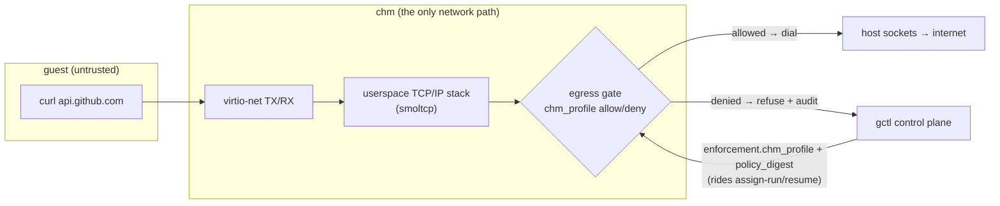

# M28 — Consistent network + filesystem policy on the Mac (Pillar ③)

**The product must-have.** The control plane sets *"sandbox N: allow-list only"*;
that policy follows the sandbox **down** to this Mac; and when the sandbox runs
locally it **genuinely cannot get out** except to the allow-list — provably, not
cosmetically. This doc is the right-sized plan to land that.

> **The demo this milestone must deliver (its acceptance test):**
> 1. In the plane, bind a policy to sandbox N: `default_egress: deny`, `egress:
>    [{allow, api.github.com:443}]`.
> 2. `chm pull` (or bring-down) sandbox N to the Mac — the compiled
>    `enforcement.chm_profile` + `policy_digest` ride the assignment down.
> 3. In the running guest: `curl https://api.github.com` **succeeds**;
>    `curl https://example.com` **fails to connect**; the denial shows up as a
>    `policy.decision.egress` audit event on the plane.

---

## Why this is achievable on macOS (the core insight)

The instinct is "we need a firewall, and macOS won't let us do tap/pf without
root." We don't need any of that — and the honest reason is stronger than a
firewall.

**`chm` already mediates 100% of the guest's network.** The guest has *no* tap,
no bridge, no host route — its only link is the virtio-net device, whose frames
pass through one Rust seam we own: the [`NetResponder`](../hypervisor/src/hvf/virtio/net.rs)
trait (`handle(frame) -> reply frames`). Today that seam is an `EchoResponder`
(answers ARP + ICMP echo, no real egress). Replace it with a **userspace NAT**
that terminates the guest's TCP/UDP/DNS flows and relays them to **host sockets
`chm` opens on the guest's behalf**, and two things happen at once:

1. **Networking becomes real** — the guest can actually reach the internet
   (`curl` works), because `chm` proxies its flows through ordinary host sockets.
   No root, no tap, no entitlement.
2. **Enforcement becomes authoritative, not bolted-on** — because *`chm` is the
   process calling `connect()`*, the allow-list is a decision made **before it
   dials**. Default-deny is literally "chm doesn't open the socket." The guest
   **physically cannot reach a destination chm refuses to dial for it** — there is
   no packet path around us.

This is exactly the model of gVisor's netstack, QEMU slirp, passt, and
libkrun/gvproxy: a userspace TCP/IP stack in front of the guest, host sockets
behind it, policy at the seam. **Making the network real and enforcing the policy
are the same piece of work.**

---

## How the policy reaches us (plane contract — already shipped)

The control-plane half of M28 is built. Gimbal Local is **one of the two
enforcers**; the plane hands us a *compiled* profile, we enforce it:

- Every `assign-run` / `resume` (and `pull`) carries an **`enforcement`** block
  when a policy is bound: `{ substrate: "apple-hvf", policy_digest, chm_profile }`
  (omitted entirely when unbound → behave as today).
- **`chm_profile`** is the compiled Mac posture:
  - `egress { default: allow|deny, allow: [host…], deny: [host…] }` — hosts are
    domain names and/or CIDRs, optionally `host:port`.
  - `fs { ro: [path…], rw: [path…] }` and `mounts: […]`.
- The **`policy_digest`** is `sha256` of the canonical policy, so the *same*
  digest governs the cloud (nftables) run and the Mac (chm_profile) resume — it
  **teleports with the session**. We verify it survives the hop.
- We report each decision back: `POST /sandboxes/{id}/report-policy-decision`
  `{ substrate, domain: "egress"|"filesystem", action, target, rule?, detail? }`
  → a `policy.decision.*` audit event (denials especially).

Nothing new is needed from the plane for the demo.

---

## Staged delivery (each stage real + shippable)

Right-sized so the hard engine work is bounded and every stage stands on its own.

### M28.1 · Policy plumbing + digest teleport  **[ships without touching the datapath]**

Consume the contract before enforcing anything:

- Parse `enforcement.chm_profile` + `policy_digest` off assign-run/resume/pull.
- Carry the profile into the run; **verify `policy_digest` is intact** end-to-end
  (recompute over the normalized policy and assert it matches what the cloud
  side ran under — proves governance survived the teleport).
- Advertise `supports_policy`; surface the bound policy + digest in the app.
- Emit a `policy received` audit line. **No egress change yet** — a bound sandbox
  still runs, we just prove the policy arrived and matches.

*Acceptance:* pull a policy-bound sandbox; the digest matches the plane's; the app
shows "governed by sha256:… (N egress rules)".

### M28.2 · Userspace egress NAT — real guest networking  **[the hard engine work]**

Replace `EchoResponder` with a `NatResponder` giving the guest **real outbound
networking**, scoped to what the demo needs:

- A userspace TCP/IP stack (**smoltcp** — see Decisions) terminates the guest's
  Ethernet/IP frames at the `NetResponder` seam.
- Guest bring-up: answer **DHCP** (or honor the snapshot's static IP) so the
  guest configures its NIC + default route + DNS to our virtual gateway; keep the
  ARP responder.
- **DNS**: forward guest queries to the host resolver and return answers.
- **TCP**: on a guest SYN, `chm` opens a host `TcpStream` to the destination and
  relays bytes both ways (connection-proxy NAT). UDP + ICMP best-effort.
- No enforcement yet — this stage is "the guest can `curl` the internet through
  chm," proven by reaching a real host.

*Acceptance:* a resumed guest runs `curl https://api.github.com` and gets a real
response, through the userspace NAT, on an unentitled Mac.

### M28.3 · The egress gate — allow-list enforcement  **[small, given M28.2]**

Insert the `chm_profile` egress decision at the two authoritative points the NAT
already owns:

- **DNS resolve**: answer only names permitted by the allow-list; refuse the rest
  (defeats "resolve elsewhere").
- **TCP connect**: before `chm` dials, match the destination (resolved IP + the
  originating name, host + port) against `egress` (author order, first match
  wins) falling back to `default`. Allow → dial; deny → refuse the guest's
  connection **and** `report-policy-decision`.
- Dual name+IP checks defeat the hardcoded-IP bypass.

*Acceptance:* under `default: deny, allow: [api.github.com:443]`, the guest reaches
api.github.com and **fails every other destination**, each denial audited.

### M28.4 · The demo + provenance proof  **[the product acceptance]**

Wire it end-to-end and make it demoable + tested:

- Bind the policy in the plane → pull sandbox N → guest reaches the allowed host,
  is blocked from the rest, denials appear in the plane's audit/insights.
- Prove the **teleport**: the *same* `policy_digest` that governed the cloud run
  governs the Mac resume (surface it both sides).
- A scripted `$0` local reproduction (like the e2e microvm loop) + docs.

*Acceptance:* the demo at the top of this doc runs green, reproducibly.

### M28.5 · Filesystem scopes  **[smaller, separate — modest by design]**

Apply `chm_profile.fs` (`ro`/`rw`) + `mounts`. Honest scope: there is **no host-FS
passthrough** (an M30 invariant), so the guest's filesystem is its own disk +
overlay — "fs scoping" here means which mounts/overlays are writable vs
read-only, and reporting `filesystem` decisions, not gating host directories.
Kept minimal and clearly bounded; the **network half is the product must**, this
rounds out the pillar.

---

## Decisions & honest hard parts

- **Use `smoltcp`, don't hand-roll TCP.** A correct userspace TCP state machine is
  the genuinely hard, error-prone part; `smoltcp` is a mature, `no_std`-friendly
  Rust TCP/IP stack built for exactly this (terminate packets in userspace, drive
  host sockets behind it). It would be a **new dependency** — not currently
  vendored — but a clearly justified one under the project's "new deps need a
  clear benefit with no adequate local alternative" rule, exactly like the `ring`
  decision for M27: hand-rolling authenticated TCP is not a reasonable local
  alternative. (A minimal hand-rolled UDP/DNS-only path is a fallback if we want
  to defer TCP, but that would not satisfy the `curl` demo.) Guest-facing =
  smoltcp; host-facing = `std::net`.
- **Enforce at DNS *and* TCP-connect.** Hostname allow-lists must gate the name
  (DNS) and re-check the resolved IP at connect, so a guest can't bypass by
  resolving out-of-band or hardcoding an IP.
- **V0 scope, stated plainly.** IPv4 TCP + DNS is the demo surface. UDP (beyond
  DNS), IPv6, ICMP-to-real-hosts, and inbound/listen are best-effort or
  out-of-scope for V0 — a denied/again-later path, never a silently-broken one.
- **This is not theater.** Because the guest has no network path except through
  `chm`, a userspace-NAT gate is the *strongest* possible enforcement, not a
  filter that can be evaded. Default-deny = we don't dial.
- **Ties to M30.** This is the security checklist's **network-policy** item;
  default-deny egress complements the isolation invariants (no host-FS
  passthrough, confined bundles, owner-only daemon). The *authenticity* of the
  policy (that the profile truly came from the plane) rides on M30.4 signed
  manifests — noted, not blocking the demo.

---

## Tracking

GitHub milestone **M28** with issues **M28.1–M28.5**; #20 is the umbrella.
Start with **M28.1** (plumbing — safe, unblocks) then **M28.2/M28.3** (the NAT +
gate — the product core), **M28.4** (the demo), **M28.5** (fs). Each pillar is
"done" only when enforced identically on both substrates (the plane already does
`linux-kvm`; this makes `apple-hvf` real).
